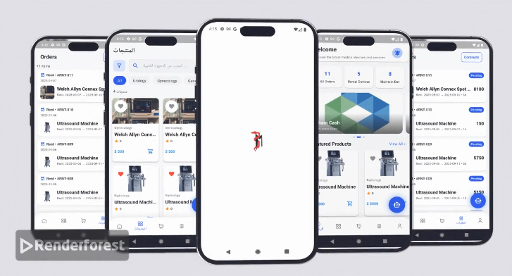

📱 BitarMed Mobile

Flutter app for buying, renting, and maintaining medical equipment.

✨ Features

🛒 Browse and purchase medical devices

📅 Rent devices for a specific period

🛠️ Submit and track maintenance requests

📊 Track orders and rentals in real-time

🔔 Push & in-app notifications

👤 Manage user profile and settings

❤️ Wishlist (favorite devices)

🌙 Dark/Light mode

🌐 Supports Arabic (RTL) & English (LTR)

🖼️Mobile App Interfaces

